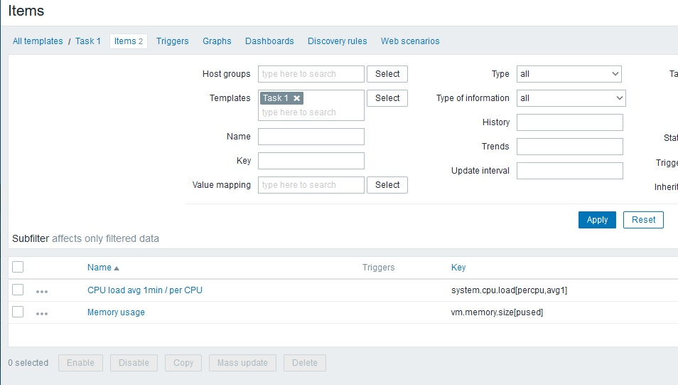
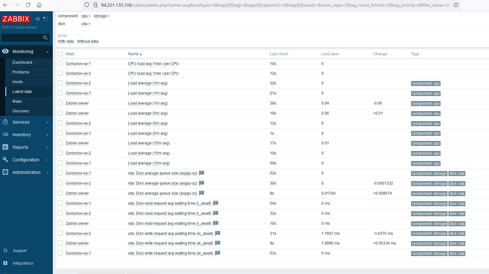
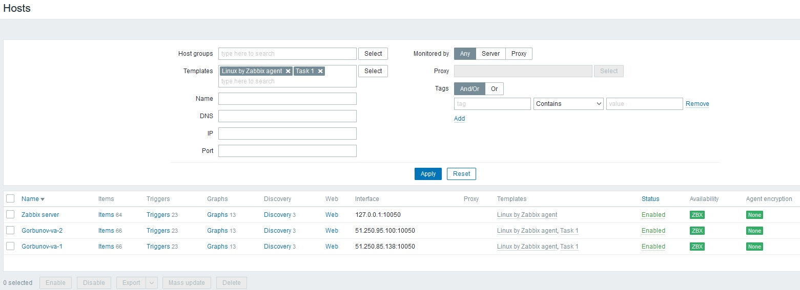
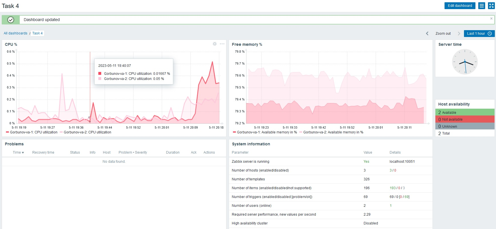
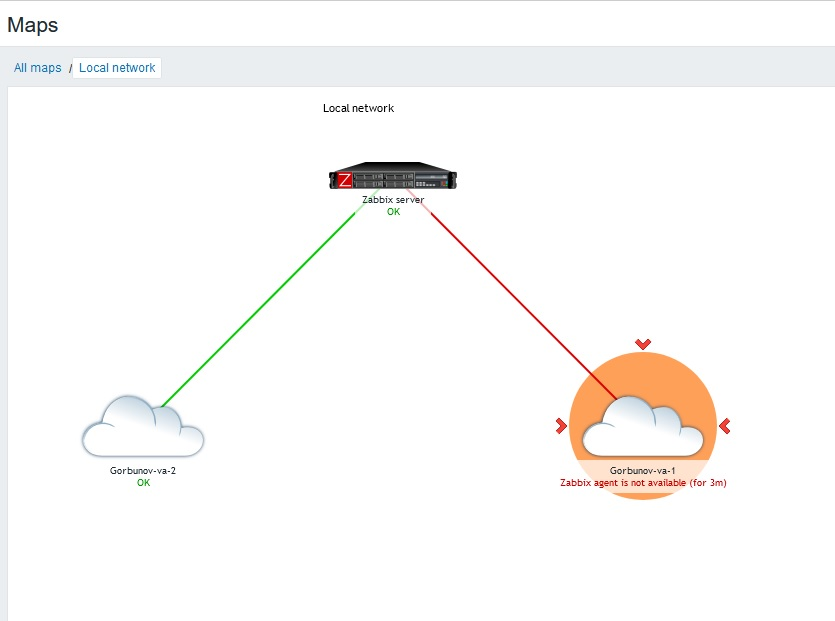
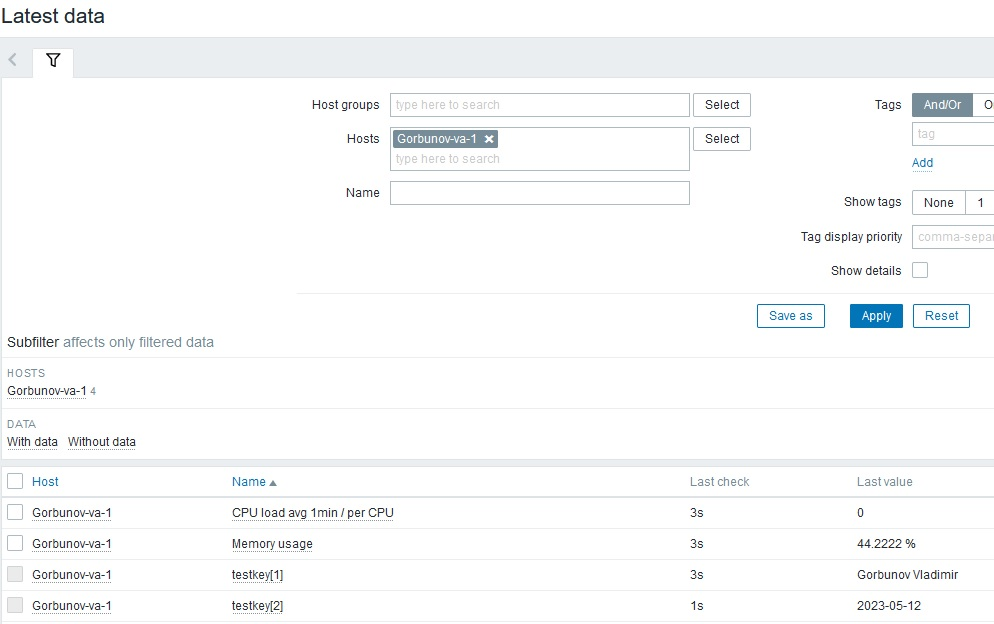
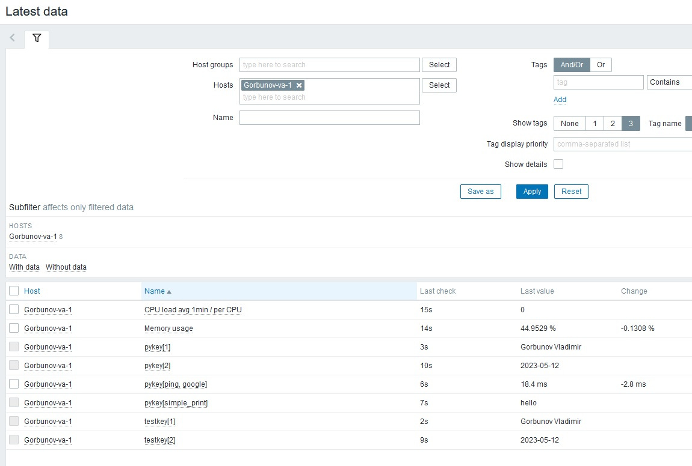
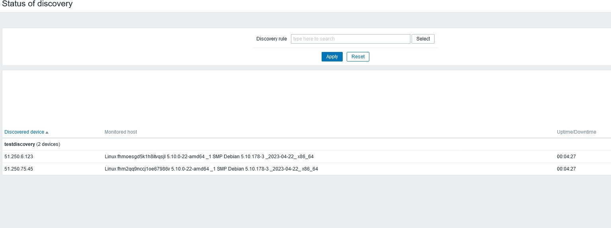

# Система мониторинга Zabbix. Часть 2
## Домашнее задание. Горбунов Владимир

## Цели задания
1. Научитьcя создавать свои шаблоны в Zabbix, добавлять в Zabbix хосты и связывать шаблон с хостами
2. Научиться составлять кастомный дашборд
3. Научиться создавать UserParameter на Bash
4. Научиться создавать Python-скрип, добавляться в него UserParameter и прикреплять к шаблону
5. Научиться создавать Vagrant-скрипты для Zabbix Agent


## Содержание
- [Задание 1. Кастомный шаблон](#Задание-1)
- [Задание 2. Добавление хостов](#Задание-2-3)  
- [Задание 3. Привязка кастомного шаблона к хостам](#Задание-2-3)  
- [Задание 4. Кастомный дашборд](#Задание-4)  
- [Задание 5. Создание карты в забиксе](#Задание-5)  
- [Задание 6. UserParameter](#Задание-6)  
- [Задание 7. Скрипт на Python](#Задание-7)  
- [Задание 8. Работа автообнаружения](#Задание-8)  
- [Задание 9. Разворачивание хостов с помощью Vagrant](#Задание-9)  

## Задание 1

Создан свой шаблон, в котором настроен мониторинг загрузки CPU и RAM хоста



## Задание 2-3

В забиксе добавлены два хоста и к ним привязан кастомный шаблон





## Задание 4

Создан кастомный дашборд для мониторинга двух хостов:



## Задание 5

Создана карта с двумя хостами, один из хостов погашен, после этого на карте отобразился сработавший триггер:



## Задание 6

Создан UserParameter на bash и прикреплен к созданному ранее шаблону. 
Он вызывает скрипт, который при получении "1" возвращает ФИО, при получении "2" возвращает текущую дату.

```
#!/bin/bash
case $1 in
    "1")
        echo "Gorbunov Vladimir"
    ;;
    "2")
        date -I
    ;;
    *)
        echo "unknown input"
    ;;
esac
```



## Задание 7

Создан параметр с кодом Python, который возвращает значение ping до заданного в запросе узла, возвращает фио при отправке "1", дату при отправке "2", и текст при отправке запроса с параметром "-simple_print":

```
import sys
import os
import re
if (sys.argv[1] == '-ping'):
    result=os.popen("ping -c 1 " + sys.argv[2]).read() 
    result=re.findall(r"time=(.*) ms", result) 
    print(result[0]) 
elif (sys.argv[1] == '-simple_print'): 
    print(sys.argv[2]) 
elif (sys.argv[1] == '1'): 
    print("Gorbunov Vladimir") 
elif (sys.argv[1] == '2'): 
    result=os.popen("date -I").read()
    print(result)
else: 
    print(f"unknown input: {sys.argv[1]}") 
```



## Задание 8

Настроено автообнаружение и прикрепление к хостам созданного ранее шаблона.



## Задание 9

Развертывание Ubuntu с помощью vagrant:


Инструкции zabbix-agent.sh для vm.provision Vagrant:


Для автоматического обнаружения хоста, развернутого с помощью вагрантфайла, необходимо задать IP адрес заббикс сервера, он передаётся шестым параметром в скрипт.
В скрипте передаются кастомные параметры на bash и python из заданий 6 и 7


